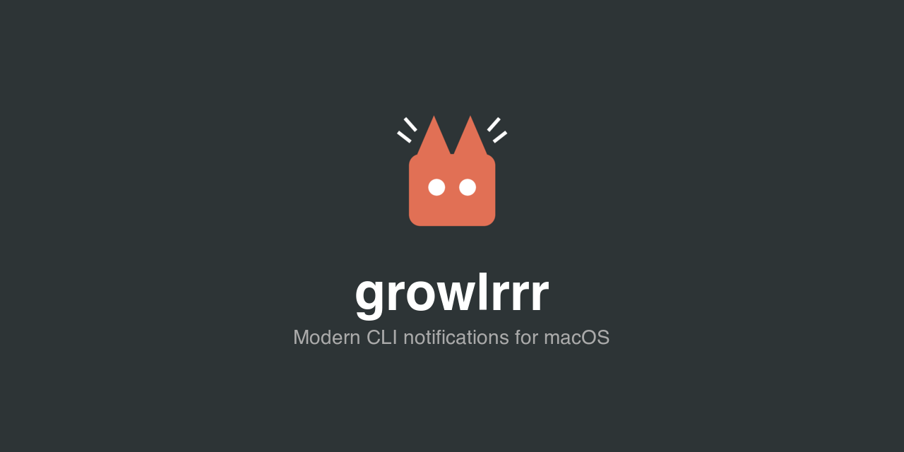

Inspired by [terminal-notifier](https://github.com/julienXX/terminal-notifier) and [alerter](https://github.com/vjeantet/alerter), which solved this problem for years until breaking changes in macOS prevented them from 
displaying custom app icons. The name is a nod to [Growl](https://growl.github.io/growl/), the original macOS notification framework, now enhanced with 3 r's. It also just happened to be a domain name I had laying around.

## Installation

### Quick Install

```bash
curl -fsSL https://raw.githubusercontent.com/moltenbits/growlrrr/main/install.sh | bash
```

### Homebrew

```bash
brew tap moltenbits/tap
brew install growlrrr
```

### Manual Install

Download the latest release and install manually:

```bash
# Download and extract
curl -L https://github.com/moltenbits/growlrrr/releases/latest/download/growlrrr-VERSION-macos.tar.gz | tar xz

# Install (requires admin privileges)
sudo mv growlrrr.app /Applications/
sudo ln -sf /Applications/growlrrr.app/Contents/MacOS/growlrrr /usr/local/bin/growlrrr
sudo ln -sf /Applications/growlrrr.app/Contents/MacOS/growlrrr /usr/local/bin/grrr
```

### From Source

```bash
git clone https://github.com/moltenbits/growlrrr.git
cd growlrrr
make install
```

> **Tip:** `grrr` is installed as a shortcut for `growlrrr` for easier autocomplete.

### Uninstall

```bash
curl -fsSL https://raw.githubusercontent.com/moltenbits/growlrrr/main/uninstall.sh | bash
```

Or with Homebrew: `brew uninstall growlrrr`

## Usage

### Send a notification

```bash
# Simple notification
grrr "Build complete"

# With title
grrr --title "CI Pipeline" "All tests passed"

# With title and subtitle
grrr --title "Deployment" --subtitle "Production" "Successfully deployed v2.1.0"

# With custom sound
grrr --sound Ping "Task finished"

# Silent notification
grrr --sound none "Background task complete"

# With click action (opens URL when clicked)
grrr --title "PR Ready" --open "https://github.com/..." "Review requested"

# Execute a command when clicked
grrr --execute "open ~/Downloads" "Download complete - click to view"

# Open a specific app when clicked
grrr --execute "open -a Safari" "Click to open browser"

# Run a script when clicked
grrr --execute "./scripts/deploy.sh" "Ready to deploy - click to start"

# Reactivate the originating terminal when clicked
# For iTerm2 and Terminal.app, reactivates the specific window/tab
# For other terminals (Warp, Alacritty, kitty), activates the app
# (Window-level control requires AppleScript support, which most terminals lack)
grrr --reactivate "Task complete - click to return"

# Chain commands
grrr --execute "cd ~/project && make test" "Click to run tests"

# Combine --open and --execute (both run when clicked)
grrr --open "https://github.com/..." --execute "afplay /System/Library/Sounds/Glass.aiff" "PR merged!"

# With image attachment (appears on right side)
grrr --image ./screenshot.png "Build artifact ready"

# Wait for user interaction
grrr --wait "Click me to continue"

# Group related notifications
grrr --threadId "build-123" "Step 1 complete"
grrr --threadId "build-123" "Step 2 complete"
```

### Custom Notification Icons

macOS displays the sending application's icon on every notification—there's no way to override this per-notification. To show a custom icon, you need a separate app bundle with that icon.

The `grrr apps add` command creates lightweight app bundles in `~/.growlrrr/apps/`, each with its own icon and bundle identifier. When you send a notification with `--appId`, growlrrr runs from that app's bundle, so macOS displays its icon.

This is useful for:
- **CI/CD pipelines**: Different icons for build success vs failure
- **Multiple services**: Distinguish notifications from different tools or projects
- **Visual priority**: Use distinct icons for alerts vs informational messages

```bash
# Create a custom app with an icon
grrr apps add --appId MyCIBot --appIcon ./ci-icon.png

# Send notifications using the custom app
grrr --appId MyCIBot --title "Build" "Passed!"
grrr --appId MyCIBot --title "Build" "Failed!"

# Create another custom app with a different icon
grrr apps add --appId DeployBot --appIcon ./deploy-icon.png
grrr --appId DeployBot "Deployed to prod"

# Update an existing app's icon
grrr apps add --appId MyCIBot --appIcon ./new-icon.png

# List custom apps
grrr apps list
grrr apps list --json

# Remove a custom app
grrr apps remove MyCIBot
grrr apps remove MyCIBot --force  # skip confirmation
```

Custom app bundles are stored in `~/.growlrrr/apps/` and persist across runs.

### List notifications

```bash
# List delivered notifications (visible in Notification Center)
grrr list
grrr list --json

# List pending (scheduled) notifications
grrr list --pending
```

### Clear notifications

```bash
# Clear all notifications (both pending and delivered)
grrr clear

# Clear specific notification by ID
grrr clear abc-123

# Clear only delivered notifications
grrr clear --delivered

# Clear only pending (scheduled) notifications
grrr clear --pending
```

### Manage permissions

```bash
# Request notification permission
grrr authorize

# Check authorization status
grrr authorize --status

# Open System Settings to notification preferences
grrr authorize --open-settings
```

## Options

### Send Options

| Option | Description |
|--------|-------------|
| `--title`, `-t` | Notification title |
| `--subtitle`, `-s` | Notification subtitle |
| `--sound` | Sound: `default`, `none`, or system sound name |
| `--image` | Path to image attachment (shows on right side) |
| `--appId` | Use a custom app (create with `grrr apps add`) |
| `--open` | URL to open when notification is clicked |
| `--execute` | Shell command to run when notification is clicked |
| `--identifier` | Custom identifier for updates/removal |
| `--threadId` | Group notifications by thread |
| `--category` | Category identifier for actionable notifications |
| `--wait` | Wait for user interaction before exiting |
| `--printId` | Output notification identifier to stdout |
| `--reactivate` | Reactivate the originating terminal when clicked. For iTerm2/Terminal.app, focuses the specific window/tab. For others, activates the app. |

### Apps Subcommands

| Command | Description |
|---------|-------------|
| `grrr apps add --appId NAME --appIcon PATH` | Create or update a custom app |
| `grrr apps list [--json]` | List custom apps |
| `grrr apps remove NAME [--force]` | Remove a custom app |
| `grrr apps update` | Update all custom apps after upgrading growlrrr |

## Shell Completion

Completion scripts are included in the app bundle at `/Applications/growlrrr.app/Contents/Resources/completions/`.

**Zsh** (add to `~/.zshrc`):
```bash
fpath=(/Applications/growlrrr.app/Contents/Resources/completions $fpath)
autoload -Uz compinit && compinit
```

**Bash** (add to `~/.bashrc`):
```bash
source /Applications/growlrrr.app/Contents/Resources/completions/growlrrr.bash
```

**Fish**:
```bash
ln -s /Applications/growlrrr.app/Contents/Resources/completions/growlrrr.fish ~/.config/fish/completions/
```

## Requirements

- macOS 13.0 (Ventura) or later
- Notification permissions (prompted on first run)

## How It Works

growlrrr is distributed as an app bundle (`.app`) which is required for macOS's `UserNotifications` framework. When installed, a symlink is created at `/usr/local/bin/growlrrr` (and `/usr/local/bin/grrr`) pointing to the executable inside the bundle.

Each custom app created with `grrr apps add` has its own bundle identifier, which means it appears as a separate app in System Settings > Notifications. Users can configure notification preferences (banners, sounds, badges) independently for each custom app.

## License

MIT
