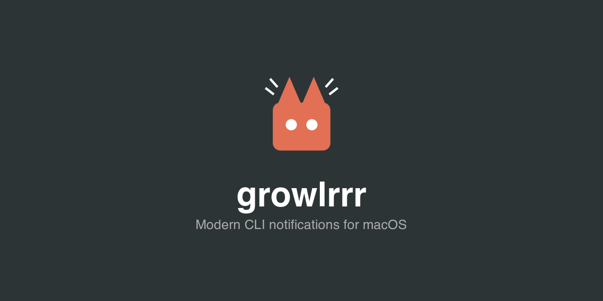

Inspired by [terminal-notifier](https://github.com/julienXX/terminal-notifier) and [alerter](https://github.com/vjeantet/alerter), which solved this problem for years until breaking changes in macOS prevented them from 
displaying custom app icons. The name is a nod to [Growl](https://growl.github.io/growl/), the original macOS notification framework, now enhanced with 3 r's. It also just happened to be a domain name I had laying around.

## Installation

### Quick Install

```bash
curl -fsSL https://raw.githubusercontent.com/moltenbits/growlrrr/main/install.sh | bash
```

### Homebrew

```bash
brew tap moltenbits/tap
brew install growlrrr
```

### Manual Install

Download the latest release and install manually:

```bash
# Download and extract
curl -L https://github.com/moltenbits/growlrrr/releases/latest/download/growlrrr-VERSION-macos.tar.gz | tar xz

# Install (requires admin privileges)
sudo mv growlrrr.app /Applications/
sudo ln -sf /Applications/growlrrr.app/Contents/MacOS/growlrrr /usr/local/bin/growlrrr
sudo ln -sf /Applications/growlrrr.app/Contents/MacOS/growlrrr /usr/local/bin/grrr
```

### From Source

```bash
git clone https://github.com/moltenbits/growlrrr.git
cd growlrrr
make install
```

> **Tip:** `grrr` is installed as a shortcut for `growlrrr` for easier autocomplete.

### Uninstall

```bash
curl -fsSL https://raw.githubusercontent.com/moltenbits/growlrrr/main/uninstall.sh | bash
```

Or with Homebrew: `brew uninstall growlrrr`

## Usage

### Send a notification

```bash
# Simple notification
grrr "Build complete"

# With title
grrr --title "CI Pipeline" "All tests passed"

# With title and subtitle
grrr --title "Deployment" --subtitle "Production" "Successfully deployed v2.1.0"

# With custom sound
grrr --sound Ping "Task finished"

# Silent notification
grrr --sound none "Background task complete"

# With click action (opens URL when clicked)
grrr --title "PR Ready" --open "https://github.com/..." "Review requested"

# Execute a command when clicked
grrr --execute "open ~/Downloads" "Download complete - click to view"

# Open a specific app when clicked
grrr --execute "open -a Safari" "Click to open browser"

# Run a script when clicked
grrr --execute "./scripts/deploy.sh" "Ready to deploy - click to start"

# Reactivate the originating terminal when clicked
# For iTerm2, Terminal.app, and Ghostty: reactivates the specific window/tab
# For other terminals (Warp, Alacritty, kitty): activates the app
grrr --reactivate "Task complete - click to return"

# Terminal reactivation details:
#   iTerm2:      Uses ITERM_SESSION_ID env var — always targets the correct session
#   Terminal.app: Captures window/tab ID at send time via AppleScript
#   Ghostty:     Captures terminal UUID at send time via AppleScript — if you switch
#                Ghostty tabs between starting a command and the notification firing,
#                the wrong tab may be targeted. Ghostty does not yet provide a session
#                ID environment variable (see https://github.com/ghostty-org/ghostty/discussions/10603)
#   Others:      Simple app activation (brings app to foreground, no tab targeting)

# Chain commands
grrr --execute "cd ~/project && make test" "Click to run tests"

# Combine --open and --execute (both run when clicked)
grrr --open "https://github.com/..." --execute "afplay /System/Library/Sounds/Glass.aiff" "PR merged!"

# With image attachment (appears on right side)
grrr --image ./screenshot.png "Build artifact ready"

# Wait for user interaction
grrr --wait "Click me to continue"

# Group related notifications
grrr --threadId "build-123" "Step 1 complete"
grrr --threadId "build-123" "Step 2 complete"
```

### Custom Notification Icons

macOS displays the sending application's icon on every notification—there's no way to override this per-notification. To show a custom icon, you need a separate app bundle with that icon.

The `grrr apps add` command creates lightweight app bundles in `~/.growlrrr/apps/`, each with its own icon and bundle identifier. When you send a notification with `--appId`, growlrrr runs from that app's bundle, so macOS displays its icon.

This is useful for:
- **CI/CD pipelines**: Different icons for build success vs failure
- **Multiple services**: Distinguish notifications from different tools or projects
- **Visual priority**: Use distinct icons for alerts vs informational messages

```bash
# Create a custom app with an icon
grrr apps add --appId MyCIBot --appIcon ./ci-icon.png

# Send notifications using the custom app
grrr --appId MyCIBot --title "Build" "Passed!"
grrr --appId MyCIBot --title "Build" "Failed!"

# Create another custom app with a different icon
grrr apps add --appId DeployBot --appIcon ./deploy-icon.png
grrr --appId DeployBot "Deployed to prod"

# Update an existing app's icon
grrr apps add --appId MyCIBot --appIcon ./new-icon.png

# List custom apps
grrr apps list
grrr apps list --json

# Remove a custom app
grrr apps remove MyCIBot
grrr apps remove MyCIBot --force  # skip confirmation
```

Custom app bundles are stored in `~/.growlrrr/apps/` and persist across runs.

### List notifications

```bash
# List delivered notifications (visible in Notification Center)
grrr list
grrr list --json

# List pending (scheduled) notifications
grrr list --pending
```

### Clear notifications

```bash
# Clear all notifications (both pending and delivered)
grrr clear

# Clear specific notification by ID
grrr clear abc-123

# Clear only delivered notifications
grrr clear --delivered

# Clear only pending (scheduled) notifications
grrr clear --pending
```

### Manage permissions

```bash
# Request notification permission
grrr authorize

# Check authorization status
grrr authorize --status

# Open System Settings to notification preferences
grrr authorize --open-settings
```

### Automatic notifications for long-running commands

Add to your `~/.zshrc` (or `~/.bashrc`):

```bash
eval "$(grrr init)"
```

Any command that runs longer than 10 seconds will automatically send a notification when it finishes. Clicking the notification reactivates your terminal window/tab.

#### Configuration

| Variable | Description | Default |
|---|---|---|
| `GROWLRRR_THRESHOLD` | Minimum seconds before notifying | `10` |
| `GROWLRRR_IGNORE` | Colon-separated commands to skip | `vim:nvim:vi:less:more:man:ssh:top:htop:tail:watch:tmux:screen` |
| `GROWLRRR_ENABLED` | Set to `0` to disable | `1` |
| `GROWLRRR_TITLE` | Fixed title; the default `✅ cmd` / `❌ cmd` moves to subtitle | _(none)_ |
| `GROWLRRR_APPID` | Custom app to send from (see `grrr apps add`) | _(none)_ |

```bash
# Notify after 30 seconds instead of 10
export GROWLRRR_THRESHOLD=30

# Also ignore docker and kubectl
export GROWLRRR_IGNORE="vim:nvim:vi:less:more:man:ssh:top:htop:tail:watch:tmux:screen:docker:kubectl"

# Use a fixed title — command status moves to subtitle
export GROWLRRR_TITLE="My Project"

# Send from a custom app (for a distinct icon in Notification Center)
export GROWLRRR_APPID=MyCIBot

# Temporarily disable
export GROWLRRR_ENABLED=0
```

To specify the shell explicitly: `eval "$(grrr init --shell zsh)"`.

### Claude Code integration

growlrrr integrates with [Claude Code](https://docs.anthropic.com/en/docs/claude-code) hooks to replace its built-in notifications with native macOS notifications. The advantage over Claude Code's own notification system is that each terminal session can have its own notification identity via `--appId` — when you have multiple Claude Code sessions running, you can tell which one needs your attention. Clicking a notification reactivates the specific terminal window and tab it came from.

**Important:** Disable Claude Code's built-in notifications to avoid redundant alerts. In Claude Code, run `/config` and set `"notifications"` to `"disabled"`, or pass `--notifications disabled` on the command line.

Generate the hooks configuration:

```bash
grrr init --format claude-code
```

Copy the output into your project's `.claude/settings.json` (or merge into an existing one). This configures two hooks:

- **Stop** — runs `grrr hook notify` when Claude finishes responding
- **Notification** — runs `grrr hook notify` when Claude needs attention (permission prompts, idle checks, etc.)
- **UserPromptSubmit** — runs `grrr hook dismiss`, which clears any outstanding notification for the current session

The notification identifiers are derived from `--appId` (or `GROWLRRR_SESSION_ID`), so each terminal session's notifications are managed independently. The shell hooks from `grrr init` will also dismiss Claude Code notifications when you return to a regular shell prompt.

#### Hook Options

`grrr hook notify` accepts options to customize behavior:

| Option | Description | Default |
|--------|-------------|---------|
| `--title`, `-t` | Notification title | `Growlrrr` |
| `--sound` | Sound: `default`, `none`, or system sound name | `default` |
| `--appId` | Use a custom app (create with `grrr apps add`) | _(none)_ |
| `--reactivate` / `--no-reactivate` | Reactivate terminal on click | `--reactivate` |

### Activate notifications via keyboard shortcut

`grrr activate` replays the action of the oldest delivered notification and clears it from Notification Center. For Claude Code notifications, this reactivates the terminal that needs attention. Run it repeatedly to work through queued notifications in FIFO order.

```bash
# Activate the oldest delivered notification
grrr activate
```

Bind to a keyboard shortcut for mouse-free workflow:

**Hammerspoon** (`~/.hammerspoon/init.lua`):
```lua
hs.hotkey.bind({"cmd", "shift"}, "n", function()
  hs.execute("/usr/local/bin/grrr activate")
end)
```

**skhd** (`~/.skhdrc`):
```
cmd + shift - n : /usr/local/bin/grrr activate
```

**BetterTouchTool**:
1. Open BetterTouchTool and select **Keyboard Shortcuts** in the trigger type dropdown
2. Click **+ Add New Shortcut** and record your shortcut (e.g. <kbd>⌘</kbd><kbd>⇧</kbd><kbd>N</kbd>)
3. Set the action to **Execute Shell Script / Task**
4. Set the launch path to `/usr/local/bin/grrr` and add `activate` as the parameter

**Karabiner-Elements** (complex modification — shell_command):
```json
{ "shell_command": "/usr/local/bin/grrr activate" }
```

> **Tip:** Set growlrrr notifications to **Persistent** in System Settings > Notifications so they queue up instead of auto-dismissing, then use the keyboard shortcut to work through them.

## Options

### Send Options

| Option | Description |
|--------|-------------|
| `--title`, `-t` | Notification title |
| `--subtitle`, `-s` | Notification subtitle |
| `--sound` | Sound: `default`, `none`, or system sound name |
| `--image` | Path to image attachment (shows on right side) |
| `--appId` | Use a custom app (create with `grrr apps add`) |
| `--open` | URL to open when notification is clicked |
| `--execute` | Shell command to run when notification is clicked |
| `--identifier` | Custom identifier for updates/removal |
| `--threadId` | Group notifications by thread |
| `--category` | Category identifier for actionable notifications |
| `--wait` | Wait for user interaction before exiting |
| `--printId` | Output notification identifier to stdout |
| `--reactivate` | Reactivate the originating terminal when clicked. For iTerm2, Terminal.app, and Ghostty, focuses the specific window/tab. For others, activates the app. |

### Apps Subcommands

| Command | Description |
|---------|-------------|
| `grrr apps add --appId NAME --appIcon PATH` | Create or update a custom app |
| `grrr apps list [--json]` | List custom apps |
| `grrr apps remove NAME [--force]` | Remove a custom app |
| `grrr apps update` | Update all custom apps after upgrading growlrrr |

## Shell Completion

Completion scripts are included in the app bundle at `/Applications/growlrrr.app/Contents/Resources/completions/`.

**Zsh** (add to `~/.zshrc`):
```bash
fpath=(/Applications/growlrrr.app/Contents/Resources/completions $fpath)
autoload -Uz compinit && compinit
```

**Bash** (add to `~/.bashrc`):
```bash
source /Applications/growlrrr.app/Contents/Resources/completions/growlrrr.bash
```

**Fish**:
```bash
ln -s /Applications/growlrrr.app/Contents/Resources/completions/growlrrr.fish ~/.config/fish/completions/
```

## Requirements

- macOS 13.0 (Ventura) or later

## Permissions

growlrrr requires certain macOS permissions depending on which features you use. Each is prompted automatically on first use.

### Notifications

**Required for:** All notification functionality (core feature)

The first time growlrrr sends a notification, macOS will prompt you to allow notifications. You can also request permission explicitly with `grrr authorize`.

**Manage in:** System Settings > Notifications > growlrrr (and any custom apps created with `grrr apps add`)

Each custom app appears as a separate entry, so you can configure notification style (banners vs alerts), sounds, and grouping independently.

### Automation (Apple Events)

**Required for:** `--reactivate` with terminals that support AppleScript (iTerm2, Terminal.app, Ghostty)

When a notification with `--reactivate` is clicked, growlrrr uses AppleScript to focus the specific terminal window/tab. macOS requires explicit permission for one app to send Apple Events to another. You'll see a prompt like:

> "growlrrr.app" wants access to control "Ghostty.app". Allowing control will provide access to documents and data in "Ghostty.app", and to perform actions within that app.

This is a one-time prompt per terminal app per growlrrr app identity. If you use custom apps (`--appId`), each one will prompt separately since they are distinct app bundles. Click **OK** to allow.

**Manage in:** System Settings > Privacy & Security > Automation > growlrrr

Without this permission, `--reactivate` can only bring the terminal app to the foreground (activating whichever window was most recently focused). With it, growlrrr can target the exact window and tab that triggered the notification. If you deny the prompt, you can grant it later in the settings above.

> **Note:** Terminals without AppleScript support (Warp, Alacritty, kitty) only use simple app activation and do not trigger this permission prompt.

## How It Works

growlrrr is distributed as an app bundle (`.app`) which is required for macOS's `UserNotifications` framework. When installed, a symlink is created at `/usr/local/bin/growlrrr` (and `/usr/local/bin/grrr`) pointing to the executable inside the bundle.

Each custom app created with `grrr apps add` has its own bundle identifier, which means it appears as a separate app in System Settings > Notifications. Users can configure notification preferences (banners, sounds, badges) independently for each custom app.

## License

MIT
